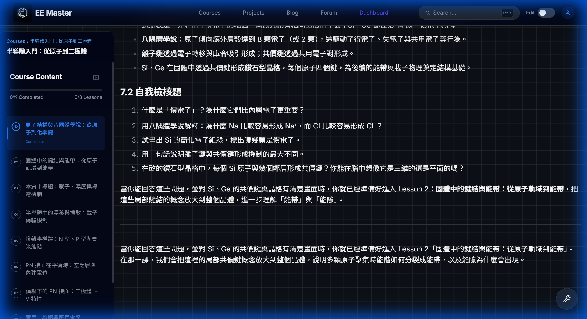
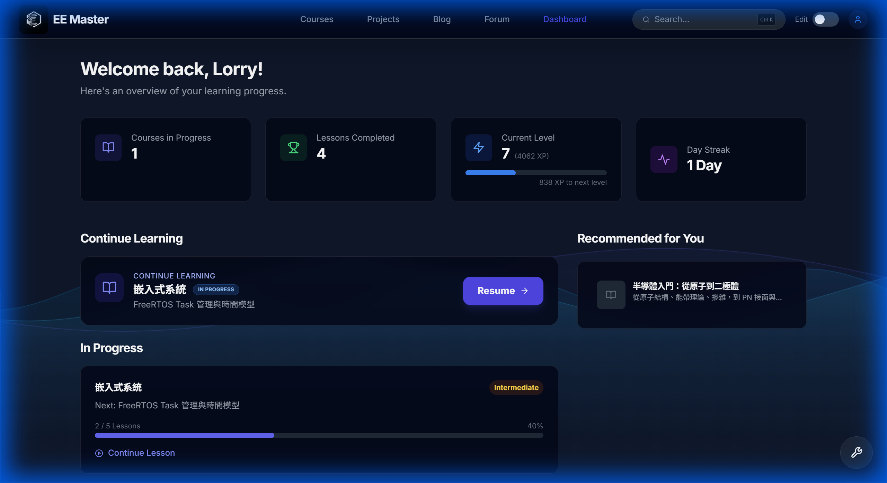

# EE Master 電子學互動學習平台說明與功能總結報告

## 一、執行摘要 (Executive Summary)

**EE Master** 是一個專為電子工程學習者打造的互動式教育平台，旨在解決傳統教學資源分散且缺乏實作路徑的痛點。平台的願景是建立一條從「入門探索」到「專業即戰力」的完整學習路徑，讓學生不僅能被動接收知識，更能透過互動與社群深化理解。

本平台採用現代化全端技術構建，以 **Next.js App Router** 為核心框架，結合 **TypeScript** 確保型別安全與開發效率。後端資料層經歷架構升級，現已採用 **PostgreSQL** 搭配 **Prisma ORM**，提供穩定且高效的資料存取能力，足以支撐複雜的課程結構、使用者進度追蹤與即時互動功能。

---

## 二、平台核心特色與技術基石 (Core Features & Technical Foundation)

### 1. 系統架構演進：從檔案型到資料庫驅動
*   **相關版本**: v3.0.0
*   **技術說明**: 平台初期採用檔案型內容管理，為了支援更複雜的互動與營運需求，在 v3.0.0 進行了關鍵的各種架構遷移。核心資料（使用者、課程、進度）正式遷移至 **PostgreSQL** 資料庫，並透過 **Prisma** 進行管理。這一決策大幅提升了資料的一致性與擴充性，是平台從原型邁向產品化的重要里程碑。

### 2. 專業工程內容呈現
*   **相關版本**: v3.1.0, v3.2.0
*   **技術說明**: 針對電子學高度依賴數學公式與圖表的特性，平台導入了完整的 **MDX 內容引擎**。
    *   **LaTeX 支援**: 整合 `remark-math` 與 `rehype-katex`，確保工程數學公式、電路推導過程能以高品質排版呈現。
    *   **多媒體整合**: 支援響應式圖片與 YouTube 影片嵌入，讓教學內容不再侷限於文字，提供更豐富的視聽體驗。

### 3. 使用者認證與社群互動 (作業要求 I)
*   **相關版本**: v2.0.0
*   **技術說明**:
    *   **會員機制**: 採用 **NextAuth.js** 建立安全的身份驗證系統，支援 session 管理與 OAuth 登入，為個人化學習歷程奠定基礎。
    *   **社群論壇 (Forum)**: 實作了完整的 Post/Comment 資料結構與 API。學生不僅是內容的消費者，更是社群的參與者，可以在論壇中提問、討論解題思路或分享學習筆記。這是平台從「單向教學」轉向「社群共學」的關鍵功能。

### 4. 後台管理與內容維護
*   **相關版本**: v3.3.0
*   **技術說明**: 為了提升營運效率，平台開發了專屬的 **Admin CMS**。
    *   **全域編輯模式 (Global Edit Mode)**: 管理員可直接在前端頁面進行內容修訂，所見即所得。
    *   **Auto-Slug**: 系統自動處理網址 Slug 的生成與防撞，簡化了課程與文章的上架流程。

---

## 三、智慧化與遊戲化 (Smart & Gamification Systems)

### 1. AI 輔助作業流程 (作業要求 II)
*   **相關版本**: v3.0.0
*   **技術說明**: 這是平台展現 AI 應用能力的亮點功能。
    *   **LLM-assisted Assignment**: 在每個章節結束後，系統會利用 LLM 自動生成針對該章節內容的小測驗，協助學生即時檢核學習成效。
    *   **VerificationPanel (檢核機制)**: 系統設計了嚴謹的驗證流程。學生作答後，若發現 AI 的解釋有誤，可以標記錯誤並透過「一鍵分享」功能將修正後的內容發布至論壇，這種「人機協作」的模式不僅修正了 AI 的幻覺，也強化了學生的批判性思考能力。

### 2. Smart Quiz 智慧測驗系統
*   **相關版本**: v4.3.0, v5.2.3
*   **技術說明**: 為了避免傳統題庫重複乏味的問題，開發了 **Smart Quiz** 出題演算法。
    *   **演算法**: 系統會綜合考量學生「已讀章節」與「尚未覆蓋的觀念」，動態生成題目，確保測驗內容具有多樣性與針對性。
    *   **Context Awareness**: **AI Tutor** 具備上下文理解能力，能根據學生當前的學習進度提供精準的提示與引導，而非通用的回答。

### 3. 精準學習進度與回饋
*   **相關版本**: v5.0.0, v5.2.7
*   **技術說明**:
    *   **LessonProgressContext**: 導入 React Context 進行即時且全域的進度狀態管理。
    *   **Smart Resume**: 首頁的「繼續學習」功能不再只是跳轉到上一課，而是智慧計算出學生最應該進行的下一個單元。
    *   **Dynamic Lesson Timer**: 為了防止學生透過快速點擊刷取經驗值 (XP)，實作了動態計時檢核機制，要求學生必須在頁面停留達「預估閱讀時間」的一定比例（如 50%）才能完成單元，確保學習的真實性。

### 4. 遊戲化驅動學習 (Gamification)
*   **相關版本**: v5.2.0, v5.2.5
*   **技術說明**: 透過遊戲化機制提升學習黏著度。
    *   **XP 經驗值與等級**: 完整的經驗值與等級系統，並採用 **Dynamic XP** 邏輯，根據課程內容的長度與難度動態計算獎勵，讓回饋感更真實公平。
    *   **Streak (每日連勝)**: 鼓勵學生養成每日學習的習慣。
    *   **徽章與證書**: 設定 clear 的成就目標（如「首堂課」、「7日連勝」），完成課程後自動頒發證書與獎勵，給予學生即時的正向回饋。

---

## 四、極致用戶體驗 (Ultimate UX)

### 1. 高效導航系統
*   **相關版本**: v5.2.0, v5.2.3
*   **技術說明**: 實作了類似 IDE 的 **Command Palette (Cmd + K)**。
    *   支援全站模糊搜尋，使用者可以快速跳轉至任何課程、文章或設定頁面。
    *   具備「無限層級導航」能力，可深入檢索課程內的特定章節 (Sections)，大幅降低資訊查找成本。

### 2. 權限與角色管理
*   **相關版本**: v5.2.3
*   **技術說明**: 實作了細緻的權限控制。例如，僅限具備「工程師」職位或相關主修的用戶擁有特定發文權限。同時，賦予創作者對自身內容的完整控制權（如刪除自己的文章），在管理與自由之間取得平衡。

### 3. 現代化介面設計
*   **相關版本**: v4.0.0
*   **技術說明**: 介面設計全面採用 **InteractiveGridPattern** 與 **Glassmorphism (毛玻璃特效)**，營造具科技感且沉浸的視覺體驗。全站採用 **RWD 響應式網格** 設計，確保在桌機、平板與手機上都能提供一致且優質的操作體驗。

---

## 🖼️ 截圖與輔助資料 (Screenshots and Context)

*(註：以下截圖為 v5.2.7 開發環境之實測畫面)*

### 1. AI 輔助作業流程
*此處展示 **ValidationPanel**。學生在完成 Lesson 後，會看到由 AI 生成的測驗題。若 AI 解釋有誤，學生可在 Verification 區塊進行修正並提交至論壇。*

### 2. Dashboard (儀表板)
*此處展示已登入學生的 Dashboard。畫面包含頂部的 **XP 進度條**、**Current Streak (連勝天數)** 卡片，以及下方的 **Continue Learning** 課程卡片，呈現個人化的學習狀態。*

### 3. 課程內容與 LaTeX 支援
*此處展示課程內頁。畫面中包含混排的文字內容與 **LaTeX 數學公式** (如 Maxwell Equations 或電路轉移函數)，以及嵌入的 **YouTube 教學影片**，展現專業內容的呈現能力。*

### 4. 論壇社群介面
*此處展示 **Forum** 頁面。可以看到學生發布的提問列表，以及進入單一文章後的 **留言 (Comment)** 互動區塊，體現社群共學的氛圍。*

