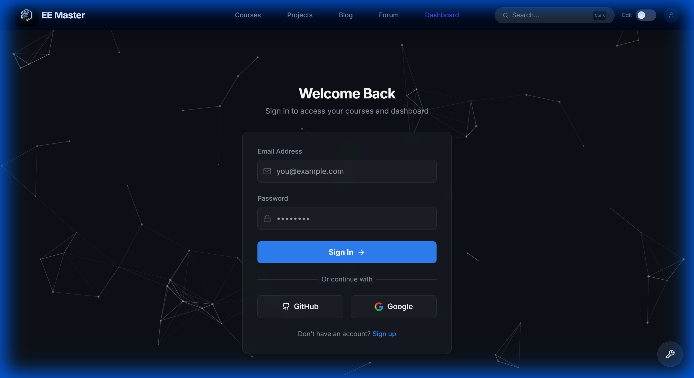
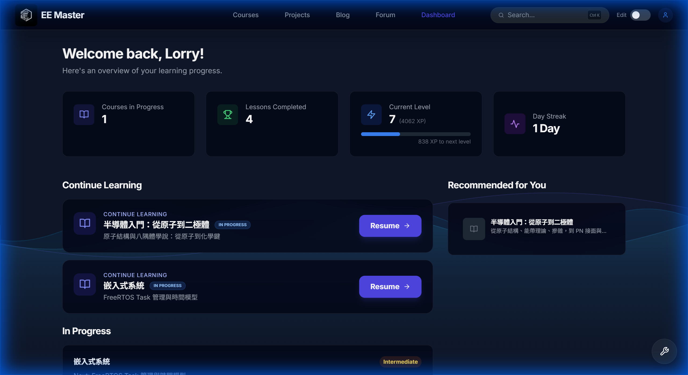
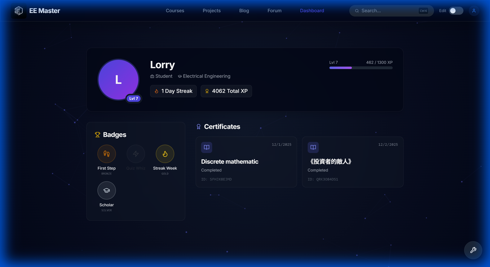
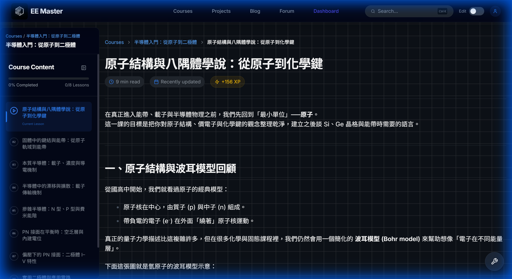
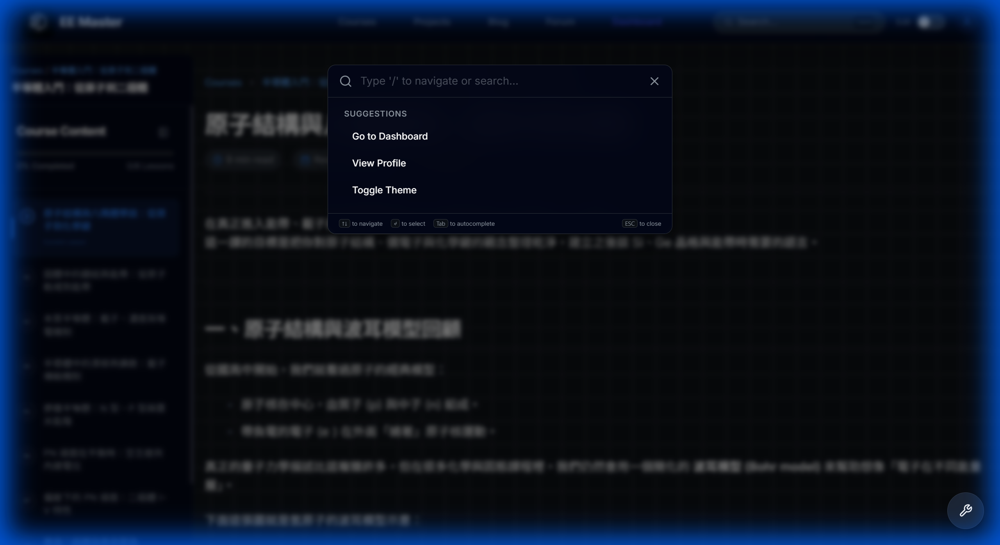
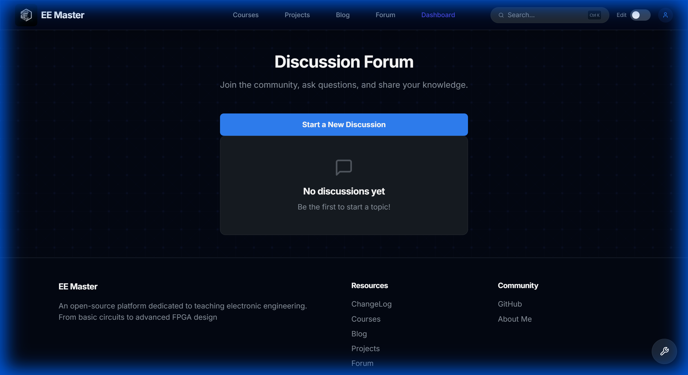
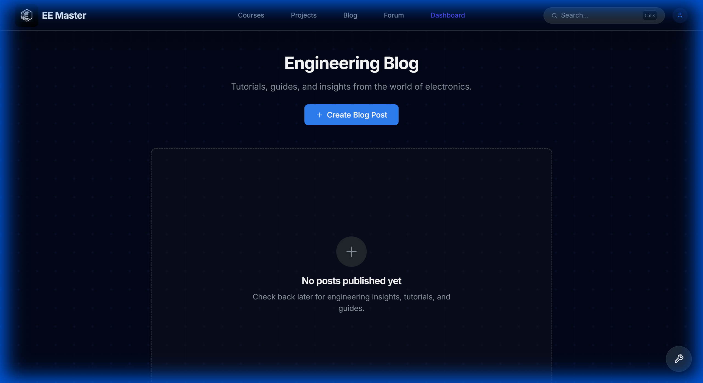
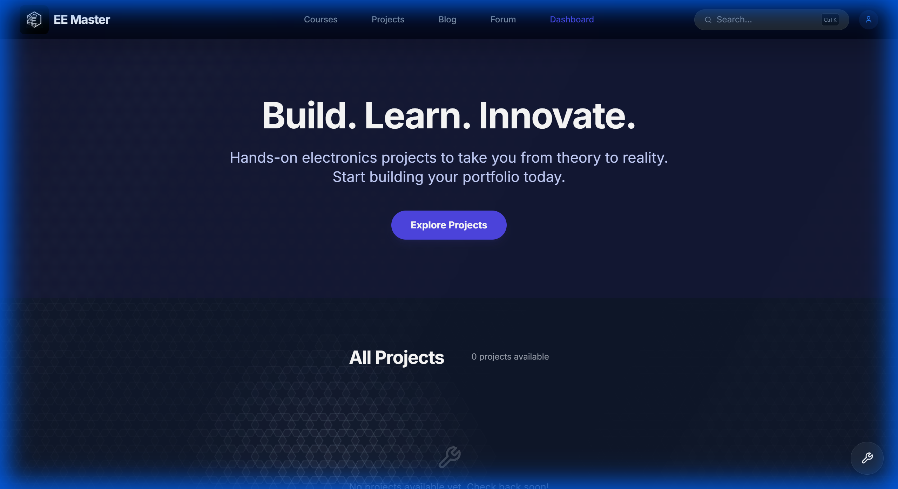

# EE Master 電子學互動學習平台 - 網站功能導覽

歡迎來到 EE Master！這是一個專為電子工程學習者打造的現代化互動平台。本指南將帶您快速瀏覽平台的核心功能，協助您充分利用我們提供的所有學習資源。

---

## 1. 登入與註冊介面 (Login & Registration)

EE Master 採用簡潔且安全的登入系統。您可以選擇使用 Google、GitHub 快速登入，或建立專屬的電子郵件帳號。登入介面採用粒子特效背景，營造科技感的同時，也確保您的帳號安全。

*圖：現代化的登入/註冊頁面，支援 OAuth 快速登入*

---

## 2. 個人儀表板 (Dashboard) - 您的學習指揮中心

登入後，您將直接進入 Dashboard。這裡是您學習旅程的起點，我們透過直觀的數據幫助您掌握學習節奏：

*   **XP 經驗值 & 等級**：頂部的進度條顯示您目前的等級與累積經驗值，讓學習像遊戲一樣充滿成就感。
*   **Streak 連勝紀錄**：右側的火焰圖示記錄您的連續學習天數，鼓勵您保持每日學習的習慣。
*   **繼續學習 (Continue Learning)**：系統會自動記錄您上次的閱讀位置，點擊卡片即可無縫接軌，繼續課程。

*圖：包含 XP、Streak 與課程進度的個人化儀表板*

---

## 3. 會員個人檔案 (Membership Profile)

點擊右上角的頭像，您可以進入個人檔案頁面。這不僅是您的個人名片，更是您學習成就的展示廳：

*   **個人資訊**：展示您的職業、主修與簡介，方便社群交流。
*   **成就徽章 (Badges)**：當您達成特定目標（如完成首堂課、連續學習 7 天等），系統會自動頒發精美徽章。
*   **完課證書**：完成課程後獲得的證書也會在此展示。

*圖：展示等級、徽章與學習歷程的個人檔案頁面*

---

## 4. AI 智慧助教 (AI Tutor & Quiz)

這是 EE Master 最核心的特色功能。我們不只是提供教材，還為您配備了一位 24 小時待命的 AI 助教。

*   **即時問答**：在課程頁面右下角的 **AI Tutor** 面板，您可以隨時針對當前內容提問。AI 會根據課程上下文提供精準的解釋，而非通用的回答。
*   **客製化測驗**：AI 能根據您閱讀的章節自動生成練習題，幫助您檢視學習成效。

*圖：整合於課程頁面的 AI Tutor，隨時為您解惑*

---

## 5. 專業課程內容 (Professional Course Content)

我們的課程內容專為工程領域設計，支援高強度的學術呈現：

*   **LaTeX 數學公式**：完美支援微積分、電路方程式等複雜數學符號的顯示。
*   **豐富多媒體**：整合圖表、電路圖與 YouTube 教學影片，提供多感官的學習體驗。

*圖：支援 LaTeX 公式與多媒體嵌入的專業課程頁面*

---

## 6. 全站快速導航 (Command Palette)

為了讓您在龐大的知識庫中也能秒速找到答案，我們開發了 **Command Palette (指令面板)**。

*   **使用方式**：按下 `Cmd + K` (Mac) 或 `Ctrl + K` (Windows/Linux)，或點擊導覽列的搜尋按鈕。
*   **功能**：您可以快速搜尋任何課程、章節、文章，甚至直接跳轉到設定頁面，實現「鍵盤優先」的高效操作。

*圖：支援模糊搜尋與快速跳轉的 Command Palette*

---

## 7. 社群論壇 (Community Forum)

學習不應該是孤單的。在 **Forum** 頁面，您可以：

*   **發布提問**：遇到難題時，向社群尋求協助。
*   **分享心得**：發表您的學習筆記或專案成果。
*   **互動交流**：在文章下方留言討論，與其他電子愛好者切磋技術。

*圖：充滿活力的技術討論區，支援 Markdown 發文與程式碼分享*

---

## 8. 工程技術專欄 (Engineering Blog)

不僅是學習，我們也鼓勵深入閱讀。**Blog** 區塊匯聚了豐富的技術文章、產業趨勢與進階教學。

*   **專業分類**：依據領域（如半導體、電路設計、職涯發展）進行分類，方便檢索。
*   **深度內容**：文章同樣支援 LaTeX 公式與程式碼高亮，適合發表高品質的技術研究。

*圖：匯聚深度技術文章的部落格專區*

---

## 9. 精選實作專案 (Hands-on Projects)

理論與實務並重是 EE Master 的核心理念。在 **Projects** 頁面，您可以找到各種難度的實作專案：

*   **專案導向學習**：每個專案都包含完整的電路圖、BOM 表與步驟說明。
*   **作品集累積**：完成的專案將記錄在您的學習歷程中，成為未來求職的最佳證明。

*圖：提供完整實作指導的專案庫*
